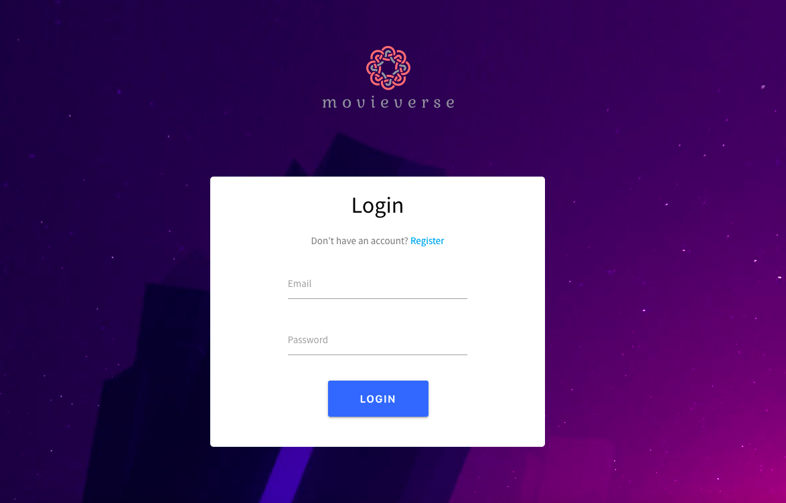
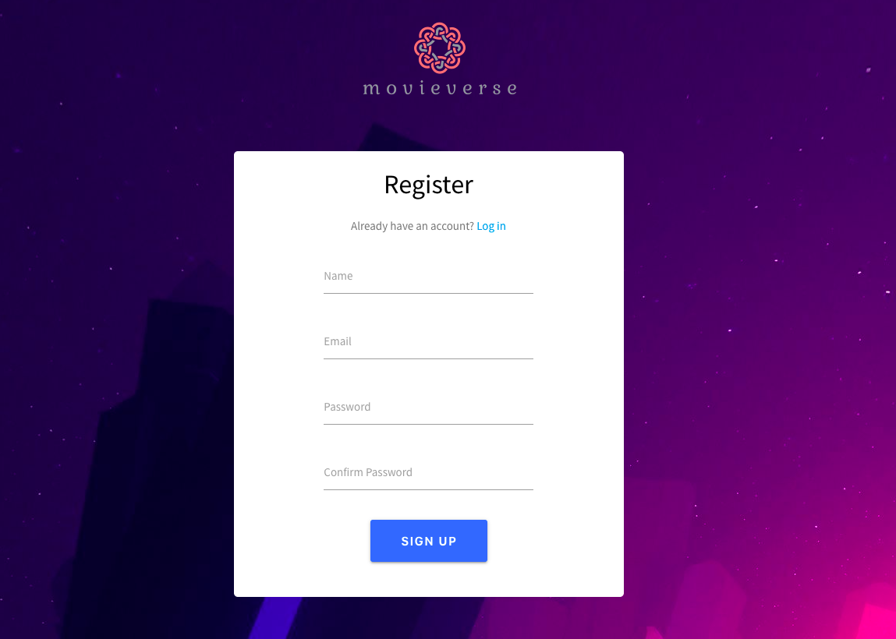
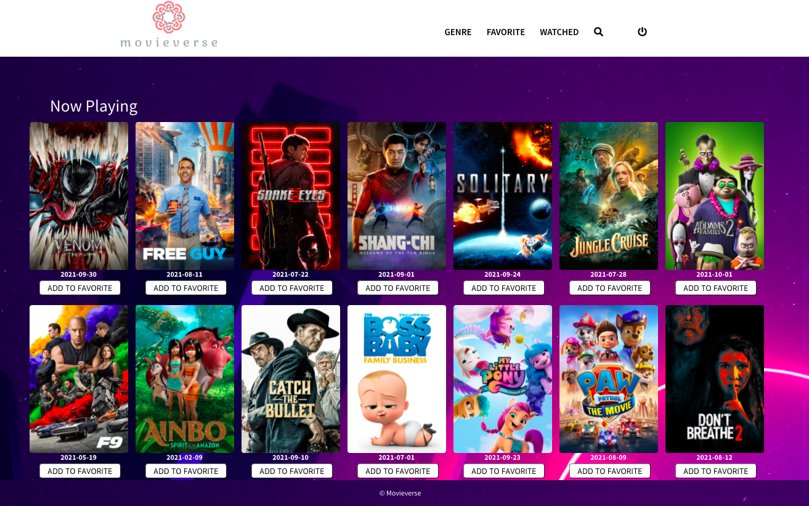
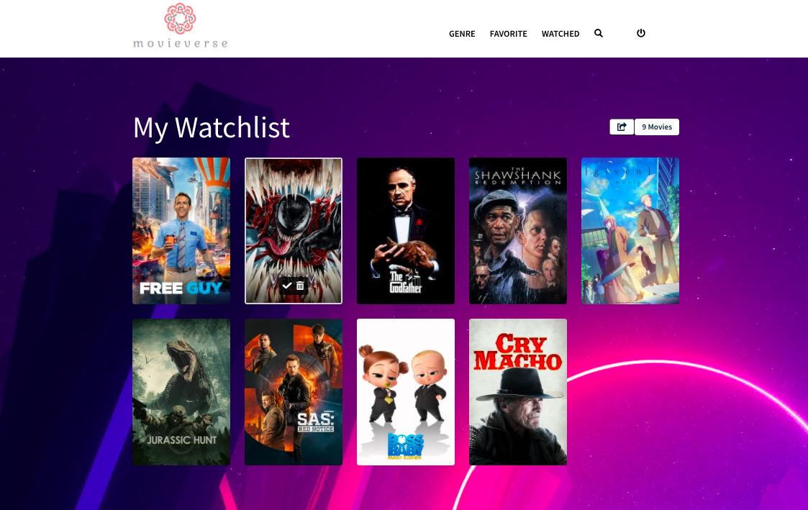
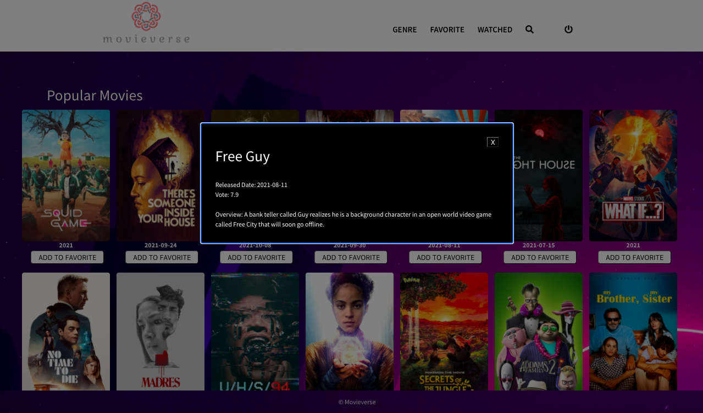
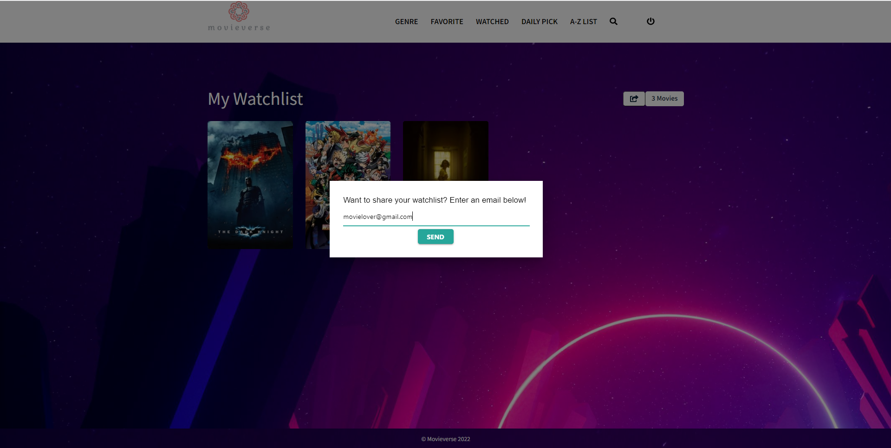
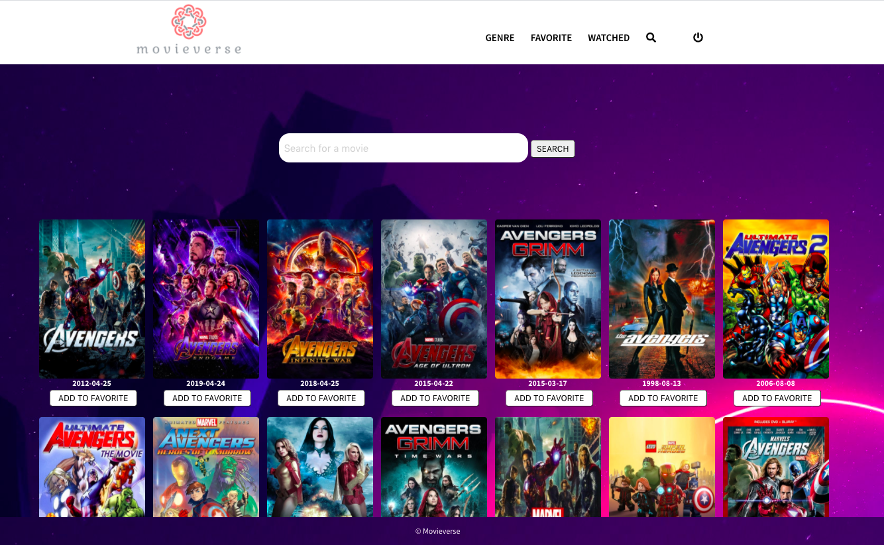

# movieverse

 A web application where users are able to search for all types of movies as well as search by category using a third-party API. User authentication is required for accessing homepage and all other features. The application has functionalities that allow users to add/remove movies in/from watchlist or watched list and the users also can share the list with friends by sending through email.

   
<b>> Coded in React.js, Node.js, MongoDB, Express.js, Passport, and Restful API
</b> 

<h4>Login page</h4>

<h4>Register page</h4>

<h4>Homepage</h4>

<h4>Watchlist</h4>

<h4>Details</h4>

<h4>Share watchlist/watchedlist</h4>

<h4>Search for movies</h4>

<h2>How to run this web application in the local environment from step by step:</h2> 
<h4> Step 1: Download packages in both client and server folders</h4>
<ul>
<li>Client folder: run this command line <b>cd client</b> in termnal and then <b>npm install</b></li>
<li>Server folder: open another terminal and make sure you don't close the terminal that is running for the clent side. 
Enter this command line <b>cd server</b> and then <b>npm install</b></li>
<li>Once these packages are installed, it's ready for the next step. </li>
</ul>
<h4> Step 2: It's time to start the applicaton</h4>
<ul>
  <li>In client folder, run <b>npm start</b></li>
  <li>In server folder, run <b>npm start</b></li>
  <li>Once both are running, go to your browser and type  <b>localhost:3000</b></li>
  <li>The application should be running now. If it's not showing on the browser, try to reinstall the packages by removing the <b>node modules</b>
  from client folder and server folder and then start over again from Step 1 </li>
</ul>

  
  
  
