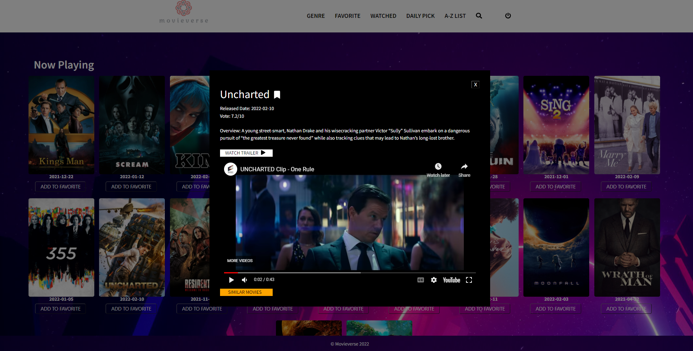

# movieverse

 A web application where users are able to search for all type of movies or search by category from a third party API. 
The application has functionalties that allows user to add movie in watchlist/watchedlist and also can share the list with friends through email.

<h4>Login page</h4>

<h4>Register page</h4>

<h4>Homepage</h4>

<h4>Watchlist</h4>

<h4>Details</h4>

<h4>Share watchlist/watchedlist</h4>

<h4>Search for movies</h4>

<h2>How to run this web application in the local environment step by step:</h2> 
<h4> Step1: Download packages in both client and server sides</h4>
<ul>
<li>Client side: run this command line <b>cd client</b> in termnal and then <b>npm install</b></li>
<li>Server side: open another terminal and make sure you don't close the terminal that is running the clent side. 
Enter this command line <b>cd server</b> and then <b>npm install</b></li>
<li>Once these packages are installed, it's ready for next step. </li>
</ul>
